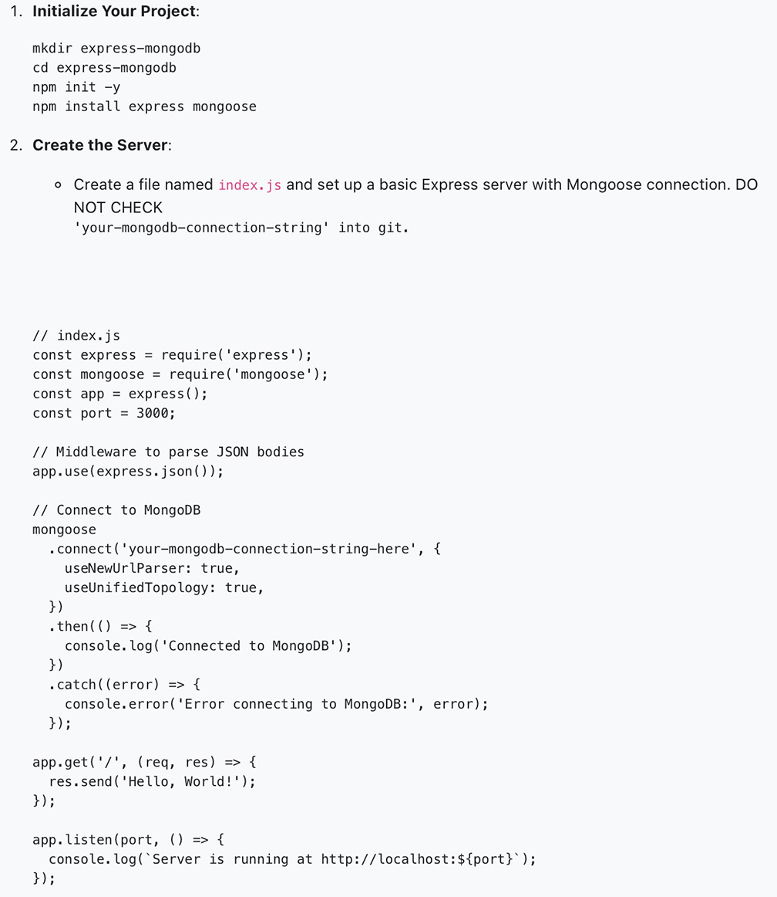
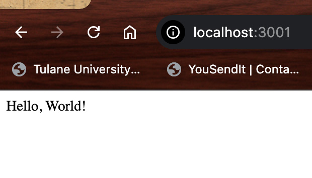
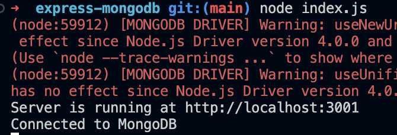

## **Express-MongoDB**

## **Objective**
- Understand MongoDB and its key features.
- Set up a MongoDB Atlas account.
- Connect to MongoDB from an Express application using Mongoose.

## **Instructions**
## Part 1: Introduction to MongoDB
- [x] Learn about MongoDB:
- MongoDB is a NoSQL database that stores data in flexible, JSON-like documents.
- Key features include being document-oriented, schema-less, and highly scalable.

## **Part 2: Setting Up MongoDB Atlas**
- [x] Create a MongoDB Atlas Account:

-  Sign up for a free account at MongoDB Atlas.
-  Create a cluster by selecting the free tier and your preferred cloud provider and region.

- [x] Create a Database User:

- Go to "Database Access" and add a new database user with a username and password.

- [x] Whitelist Your IP Address:

- Go to "Network Access" and add your current IP address.
- Connect to Your Cluster:
- Go to "Clusters", click "Connect", and select "Connect Your Application".
- Choose "Node.js" and version "3.6 or later".
- Copy the connection string.

## **Part 3: Connecting to MongoDB from an Express Application**

## **Test the Connection:**
- Start your server using Nodemon or node index.js.
- Check the console for "Connected to MongoDB".
- Navigate to http://localhost:3001/ in your browser to see "Hello, World!".

- [x] Store your database url in an .env file.
- [x] Create a .env file to hold your mongo connection string
- [x] use the dotenv module to load your mongo connection string
- [x] place your mongo connection string in your index.js file to keep it private.
- [x] Check your code into git.
- [x] Test the connection again.

